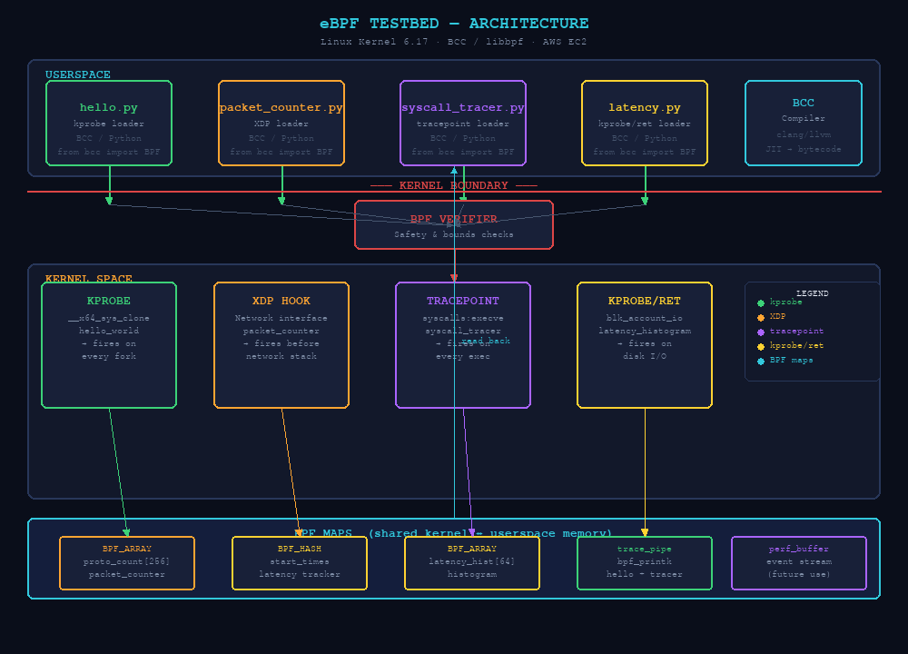

# ebpf-testbed

A collection of eBPF programs for learning and experimentation — covering XDP packet processing, kprobe-based syscall tracing, and block I/O latency histograms, all using modern **libbpf CO-RE** with Python userspace loaders (no BCC required).

## What is eBPF?

eBPF (extended Berkeley Packet Filter) is a Linux kernel technology that lets you run sandboxed programs in the kernel without changing kernel source code or loading kernel modules. Programs are verified for safety by the kernel before execution, then JIT-compiled for near-native performance. It powers tools like Cilium, Falco, bpftrace, and many observability platforms.

## What is CO-RE?

**CO-RE (Compile Once – Run Everywhere)** is the modern approach to writing portable eBPF programs. Instead of re-compiling against the running kernel's headers at load time (the BCC approach), CO-RE programs:

1. Use **`vmlinux.h`** — a single auto-generated header with all kernel type definitions, exported via BTF (BPF Type Format)
2. Use **`bpf_core_read.h`** helpers that adjust field offsets at load time using BTF relocation
3. Compile once with clang and run on any kernel that exposes BTF (≥ 5.4, universal on ≥ 5.8)

This eliminates the BCC runtime compilation dependency and is the recommended approach for production eBPF tooling.

---

## Prerequisites

| Requirement | Details |
|---|---|
| Linux kernel | ≥ 5.8 (ring buffer support) |
| libbpf-dev | `sudo apt install libbpf-dev` |
| bpftool | `sudo apt install linux-tools-$(uname -r)` |
| Clang/LLVM | ≥ 10 (`sudo apt install clang llvm`) |
| Python | 3.8+ |
| Root access | All loaders must run as root |

> **Note:** BCC is no longer required. Loaders use `ctypes` + `libbpf.so` directly.

See [docs/setup.md](docs/setup.md) for full installation instructions.

---

## Quick Start

```bash
# Clone the repo
git clone https://github.com/cbdonohue/ebpf-testbed.git
cd ebpf-testbed

# Generate vmlinux.h (kernel BTF export — do once per machine)
BPFTOOL=$(ls /usr/lib/linux-tools/*/bpftool | head -1)
sudo $BPFTOOL btf dump file /sys/kernel/btf/vmlinux format c > src/common/vmlinux.h

# Run the hello world example
cd src/hello_world
sudo python3 hello.py

# Run the syscall tracer
cd src/syscall_tracer
sudo python3 syscall_tracer.py

# Count packets per protocol on eth0
cd src/packet_counter
sudo python3 packet_counter.py eth0

# Block I/O latency histogram (refresh every 5s)
cd src/latency_histogram
sudo python3 latency.py

# Run static tests (no root needed)
make test
```

---

## Architecture



The diagram shows the full CO-RE stack: Python loaders in userspace invoke clang to compile `.bpf.c` programs to BPF object files, which pass through the kernel verifier before being attached to hook points (kprobe, XDP, tracepoint). Data flows back to userspace via **BPF ring buffers** (`BPF_MAP_TYPE_RINGBUF`) for event streaming and **BPF arrays** for aggregate stats. `bpftool` handles loading and pinning; `libbpf.so` is used directly via `ctypes` for map access.

### Key components

- **`src/common/vmlinux.h`** — generated from the running kernel's BTF; contains all type definitions. Replaces per-kernel header trees.
- **`BPF_MAP_TYPE_RINGBUF`** — modern lock-free ring buffer for event streaming. Replaces perf buffers and `bpf_printk`.
- **`ctypes` loaders** — pure Python userspace, no BCC runtime needed.

---

## Programs

| Program | Type | Hook Point | Output |
|---|---|---|---|
| [hello_world](src/hello_world/) | kprobe | `__x64_sys_clone` | PID + comm via ring buffer |
| [packet_counter](src/packet_counter/) | XDP | network interface | Per-protocol packet counts (BPF array) |
| [syscall_tracer](src/syscall_tracer/) | tracepoint | `sys_enter_execve` | PID + comm + filename via ring buffer |
| [latency_histogram](src/latency_histogram/) | kprobe/kretprobe | `blk_account_io_*` | log2 latency histogram + ring buffer events |

---

## Project Structure

```
ebpf-testbed/
├── README.md
├── Makefile
├── .gitignore
├── requirements.txt
├── src/
│   ├── common/               # Shared headers
│   │   └── vmlinux.h         # Generated kernel BTF (git-ignored, run bpftool to create)
│   ├── hello_world/          # Minimal kprobe → ring buffer
│   ├── packet_counter/       # XDP packet stats (BPF array)
│   ├── syscall_tracer/       # execve tracing → ring buffer
│   └── latency_histogram/    # Block I/O latency → histogram + ring buffer
├── tests/
│   ├── test_syntax.py        # Static checks on .bpf.c files (CO-RE style)
│   └── test_loaders.py       # Smoke tests for Python loaders (no-BCC checks)
└── docs/
    ├── setup.md              # Installation + kernel config
    └── examples.md           # Usage examples + expected output
```

---

## Documentation

- [Setup Guide](docs/setup.md) — kernel requirements, libbpf/bpftool install, vmlinux.h generation
- [Usage Examples](docs/examples.md) — how to run each program with expected output

---

## Migration from BCC

This repo was originally written using BCC (Python `from bcc import BPF`). It has been fully migrated to **libbpf CO-RE**:

| Before (BCC) | After (CO-RE) |
|---|---|
| `#include <uapi/linux/ptrace.h>` | `#include "vmlinux.h"` |
| `BPF_PERF_OUTPUT(events)` | `BPF_MAP_TYPE_RINGBUF` |
| `bpf_trace_printk(...)` | `bpf_ringbuf_reserve/submit` |
| `BPF_HISTOGRAM(...)` | `BPF_MAP_TYPE_ARRAY` + ring buffer |
| `from bcc import BPF` | `ctypes.CDLL("libbpf.so.1")` |
| Runtime kernel header compilation | `vmlinux.h` + BTF relocation |

---

## License

GPL-2.0 — consistent with the Linux kernel's licensing requirements for eBPF programs.
